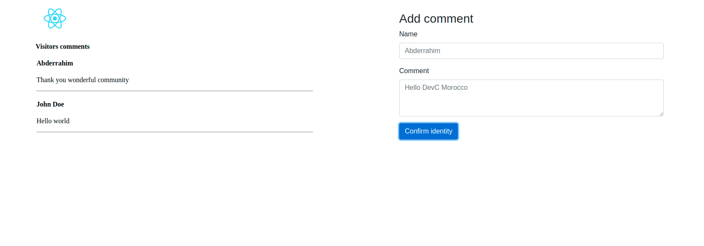

# Build a simple app using micro-frontend architecture

Micro-frontend is a new way to use multiple frontend fragment such spa or vanilla javascript application in the same main frontend application.

In this tutorial we are going to see how we can use a vanilla javascript app beside react application to create "Golden Book" app where visitors can submit comments.



## 1. Main application 

It's the application that will be the host for two other apps and it's a webpack based application with the main entry point is `index.html` 

```html
    <div class="flex-grid-thirds">
        <div class="col">
            <web-merge id="react" content="http://localhost:3000"></web-merge>
        </div>
        <div class="col">
            <web-merge content="./fragments/form.html"></web-merge>
        </div>
    </div>
```

The magic here is played by the open-source package [web-merge](https://github.com/AbderrahimSoubaiElidrissi/web-merge) this package will allow us to include our two application located in folder fragments as you can see `web-merge` allow to add react app using url and vanilla javascript app using filename.
Include web-merge is easy see `src/index.js`.

## 2. Form application (vanilla javascript) 

This simple javascript based application is just an HTML form with [Bootstrap](https://github.com/twbs/bootstrap) that and a javascript function that will handle a form submit and trigger a state management event

```js
const { state } = parent;
// initial state
state.init({ comments: [] })
const ADD = "add";

// Action
state.on(ADD, ({ comments }) => {
    const react = parent.document.querySelector('#react').shadowRoot.querySelector("iframe");
    react.contentWindow.postMessage(comments, '*');
});

// form handler
const add = (e) => {
    e.preventDefault();
    state.dispatch(ADD, ({ comments }) => {

        const name = document.querySelector("#name").value
        const message = document.querySelector("#comment").value

        document.querySelector("#name").value = ""
        document.querySelector("#comment").value = ""

        return { comments: [...comments, { name, message }] }
    });

}

document.querySelector('form').addEventListener("submit", add);

```

## 3. Comments application (React javascript) 

Simple CRA application using  [React framework](https://github.com/facebook/react) by Facebook this spa is listing the comments as list while listening to state change


## Test project 
You can run project using this commands:

```sh
# install deps
$ npm install
$ cd fragments/react-app && npm install

# Run

$ npm start

```

## License 
MIT
